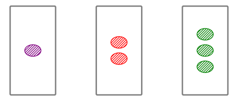

# Hány SET van az ábrán?

## A SET játék
A SET egy 81 lapos kártyajáték.  Minden kártya négy tulajdonsággal rendelkezik, amelyek a következők lehetnek:
- Minden kártyán 1, 2 vagy 3 egyforma alakzat szerepel
- Az alakzat formája lehet ovális, hullám (nálunk téglalap) vagy rombusz
- A színe lehet piros, zöld vagy lila
- A kitöltése pedig üres, csíkos vagy telített.

Egy kártyahármast SET-nek nevezünk, ha a lapokon szereplő minták 4 tulajdonságára igaz, hogy egy adott tulajdonság vagy megegyezik minden lapon, vagy eltérnek egymástól. 

Például a következő laphármas egy SET-et alkot:

Az alapjáték a következő képpen zajlik: a játékosok előtt 12 lap van. A céljuk azonos: minél hamarabb találni egy SET-et. A leggyorsabb játékos megkapja az általa talált SET mindhárom lapját, majd a közös kártyakészletet kiegészítik újból 12 lappá. A játék végetér, ha ez már nem tehető meg, nem maradt hozzá elég kártya. Ekkor a legtöbb lapot gyűjtő játékos nyer. 

## A programunk lényege
Az általunk készített program az alapjáték egy változata. A cél már nem egy SET megtalálása, a kérdés, amelyet a játékos meg szeretne válaszolni a következő: hány SET van az ábrán?

## A játék menete részletesebben
A játék a lapok számának megválasztásával kezdődik. Ezt követően a “Start Game” gombot megnyomva vagy Entert ütve tudunk átjutni a következő ablakba. Itt annyi kártya lesz három sorban megadva, amennyit az előző ablakban kértünk, és a “How many sets do you see?” kérdésre kell válaszolni. A cél a helyes válasz eltalálása. Ehhez segítséget is kaphatunk, amely megmodja, hogy mennyi a várható értéke a SET-ek számának,
- Ha csak a kártyák számát tudjuk
- Ha tudjuk hogy az egyes forma-darabszámokból hány kártyánk van az ábrán
- Ha tudjuk hogy az egyes formákból hány kártyánk van az ábrán
- Ha tudjuk hogy az egyes színekből hány kártyánk van az ábrán
- Ha tudjuk hogy az egyes kitöltés fajtákból hány kártyánk van az ábrán

Innét a “Submit Guess” gombbal vagy Entert ütve tudunk a továbbmenni, ahol megtudjuk, jól tippeltünk-e. Ezután három lehetőségünk van: indíthatunk új játékot, megnézhetjük a helyes megoldásban szereplő SET-eket, vagy kiléphetünk a programból. 

## Játék futtatása

Tetszőleges python környezetből futtatható a kód.

A játék a következő python package-ket használja:
- PySimpleGUI
- random
- itertools
- matplotlib
- math
- collections

## A SET-ek várható értéke
Hogyan számoljuk ki a segítségben megjelenített várható értékeket?

- Ha csak a kártyák számát tudjuk: .
    1. Annak a valószínűsége, hogy három (visszatevés nélkül) véletlenszerűen választott lap egy SET-et alkot: $1/79$.
    Ez azért van, mert tetszőleges két kártyára igaz, hogy a maradék 79 lap közül pontosan egy olyan van, amely velük együtt egy SET-et képez.
    2. Jelölje $X$ valószínűségi változó a SET-ek számát az $n$ kiválasztott kártyában. 
    Legyen $m = \binom n 3$ és legyenek $X_1, X_2, \dots X_m$ azon valószínűségi változók, amelyekre
 
        $X_i = \begin{cases}1 \text{, ha az } i \text{-edik laphármas SET-et alkot}\\
        0 \text{, különben} \end{cases}$
    3. Vegyük észre, hogy $X = \sum_{i=1}^m X_i$, tehát $\mathbb E[X] = \sum_{i=1}^m \mathbb E[X_i] = m/79$.

- Tegyük fel, hogy a lapok száma mellett a színeloszlása is adott.. 
    1. Legyen $P$ a piros, $Z$ a zöld, $L$ a lila lapok száma. Az előzőhöz hasonlóan vegyük fel az $X$, valamint az $X_1, \dots X_m$ valószínűségi változókat.
    2. Minden $i$-re $X_i$ egy fix laphármosahoz tartozik. Egy ilyen laphármas tartalmazhat egy, kettő vagy három különböző színt. 
    3. $1/25$ annak a valószínűsége, hogy három azonos színű lap egy SET-et alkot. Ez a valószínűség három különbözű színű lapra $1/27$. Azt is tudjuk, hogy ha csak két szín jelenik meg, a laphármas nem alkothat SET-et.
    4. Az azonos színű laphármasok száma $\binom P 3 + \binom Z 3 +\binom L 3$, míg a különböző színűeké $P\cdot Z \cdot L$
    5. Ezek alapján a SET-ek számának várható értékére a következő becslés adódik: $\mathbb E [X] = (\binom P 3 + \binom Z 3 +\binom L 3) \cdot 1/25 + P\cdot Z\cdot L / 27$

A többi segítség értékét is ki lehet számítani az előzőekben bemutatott várható érték módszer segítségével.

## AI használata

- A kártyák konkrét kirajzolásához használtunk AI-t, ami a függvény meghívásakor 4 darab string értéket kért a kártyák tulajdonságairól, ezt módosítottuk, hogy hozzáilleszthető legyen a kódunkban eltárolt kártyaformátumhoz, tehát egy 0-1-2-es számnégyessel leírt formátumból olvassa ki a megfelelő kártyatulajdonságokat. Az általa visszaadott kódon többek között az alakzatok méretét, elhelyezkedését is megváltoztattuk, hogy méretarányosak legyenek és a valóságban használt kártyákhoz hasonlítsanak (amelytől végül annyiban eltértünk, hogy téglalapot használtunk és nem hullám jelet). Illetve eredetileg 4 oszlopot akartunk csinálni és n/4 felső egészrész db sort, végül 3 sorra és n/3 felső egészrész oszlopra változtattuk, hogy egyszerre kiférjenek a képernyőre.
- Még sohasem csináltunk semmi UI-hoz hasonló dolgot, úgyhogy a UI készítés első lépésként megkérdeztük a Claude-ot, milyen python package-et érdemes használni egy ilyen projekthez (ezen a ponton a játék egy Jupiter Notebook-ban futtatható változata már készen volt, ami igazából mindent tudott, amit a végső játék, csak a tipp bekérése és a végeredmény kirajzolása is a Notebook-on belül történt). 4 javaslata volt, ezek közül a leírások alapján a PySimpleGUI-t választottuk, mert az tűnt a legegyszerűbbnek. Ezen a ponton már egy elég határozott képünk volt arról, hogy hogyan nézzen ki a játék, melyik oldalon milyen gombok és lehetőségek szerepeljenek. A 0-ról UI-t írni még így is elég nehéznek bizonyult, így végül megkértük az AI-t, hogy készítsen egy prototípust. Ez még nyilván tartalmazott hibákat, de arra mindenképp jó volt, hogy megtanultuk, hogyan lehet számokat bekérni és különböző elemeket elhelyezni a képernyőn. Ezután többek között a következőket kellett átírni:
    - A játékablak a kártyák képének mérete miatt használhatatlan volt, mert nem lehetett elérni az alján a gombokat. Ehhez végül ezt a kódrészt és a kártyák kirajzolását is módosítani kellett (emiatt lettek végül a kártyák 3 sorban kirajzolva).
    - Beraktuk a Help gombot, és magát a megjelenő segítséget.
    - A SET-ek megjelenítésének oldalán sem fért el a kép (nem túl meglepő módon), erre egy görgethető megoldást választottunk, amihez végül mégegyszer kellett az AI segítségét kérni. A megoldása egyébként nem működött, de sikerült kijavítanunk a kódját.
    - A fókuszálás és az ablakok középre igazítása is a mi munkánk volt, valamint az is, hogy a jobb felső x-re kattintva bezáródjon a játék.

## Próba futtatás
Első ablakban megadjuk, hogy 8 lapot kérünk, majd az Entert nyomjuk le. Ekkor 3 db oszlopot rajzol ki a program, ahol a jobb alsó sarokban nincs kártya. Mi tippelünk egy számot a Help alapján. Beírjuk: …  
Utána a Submit Guess gombra nyomunk. A  következő ablakban lesz a válasz:... és megnyomjuk a Show sets gombot. Itt a bal oldalon végignézzük a helyes laphármasokat, majd Back gombra nyomva visszajutunk az előző oldalra, és az Exit gombbal kilépünk a játékból.
